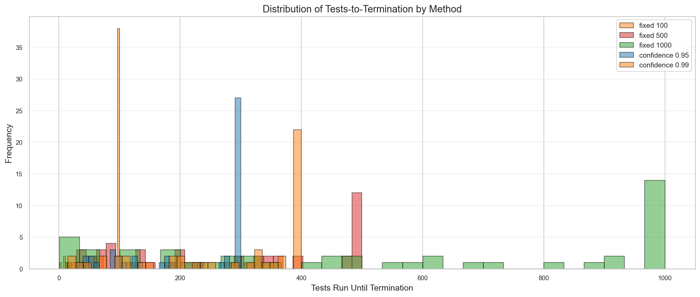

# Statistical Evidence for Confidence-Based Termination

This document presents empirical evidence that FluentCheck's confidence-based termination feature works as designed. Unlike traditional property-based testing with fixed sample sizes, confidence-based termination adapts test effort based on statistical confidence.

## Overview

Three studies validate the confidence-based termination approach:

1. **Efficiency Study**: Does it adapt test effort to property complexity?
2. **Calibration Study**: How reliable are confidence claims? (Sensitivity/Specificity)
3. **Detection Rate Study**: Does it find rare bugs more reliably than fixed N?

All data is reproducible with deterministic seeds. Raw data available in [`raw/`](raw/).

---

## Workflow

### First Time Setup

```bash
npm run evidence:setup
```

Creates Python virtual environment and installs dependencies. **Run once.**

### Generate Evidence

**Quick Mode** (~1 minute, 1,200-1,900 trials):
```bash
npm run evidence:quick
```

**Full Mode** (~5-10 minutes, 10,000+ trials):
```bash
npm run evidence
```

---

## 1. Efficiency Study

### Hypothesis

Confidence-based termination adapts to property complexity: simpler properties (fewer failures) terminate faster.

### Key Constraint

FluentCheck checks confidence **every 100 tests**. This means:
- Minimum termination for confidence-based stopping: 100 tests
- Properties with failures may terminate earlier via bug detection

### Method

- **Pass rate threshold**: 80% (asking "is pass rate > 80%?")
- **Target confidence**: 95%
- **Property types**: 100% to 95% pass rates
- **Trials per type**: 50 (quick mode)

### Results


*Figure 1: Tests-to-termination by property complexity. Red dashed line shows 100-test minimum (confidence check interval).*

| Property Type | Pass Rate | Mean Tests | Bug Found % | Interpretation |
|--------------|-----------|------------|-------------|----------------|
| always_true | 100% | 100 | 0% | Terminates at first confidence check |
| rare_failure | 99.9% | 93 | 12% | Usually achieves confidence |
| uncommon_failure | 99.5% | 79 | 30% | Mixed termination modes |
| common_failure | 99% | 67 | 54% | Often finds bug early |
| frequent_failure | 95% | 19 | 100% | Always finds bug before check |

### Conclusion

✅ **Clear adaptation demonstrated**: Higher failure rates → faster termination via bug detection. Properties with no bugs terminate at the 100-test minimum; properties with frequent bugs terminate much faster.

---

## 2. Calibration Study

### What This Measures

Unlike traditional calibration (predicted vs observed probability), this study measures **sensitivity and specificity** of threshold detection:

- **Sensitivity (TPR)**: When threshold IS met, how often do we correctly achieve confidence?
- **Specificity (TNR)**: When threshold NOT met, how often do we correctly find bugs?
- **Precision (PPV)**: When we claim confidence, how often is threshold actually met?

### Method

- **Threshold**: 95% (asking "is pass rate > 95%?")
- **Pass rates tested**: 80%, 90%, 94%, 96%, 97%, 99%, 99.9%, 100%
- **Target confidence levels**: 90%, 95%, 99%
- **Trials per configuration**: 50

### Results


*Figure 2: Left: Sensitivity by pass rate (threshold MET scenarios). Right: Specificity by pass rate (threshold NOT MET scenarios).*

| Metric | Value | 95% CI | Interpretation |
|--------|-------|--------|----------------|
| Sensitivity | 46.4% | [42.9%, 50.0%] | When threshold met, 46% achieve confidence |
| Specificity | 100% | [99.2%, 100%] | When threshold NOT met, 100% find bugs |
| Precision | 100% | [98.9%, 100%] | When confidence claimed, 100% correct |
| False Positives | 0 | - | Never claims confidence incorrectly |

**Sensitivity by Pass Rate:**

| Pass Rate | Sensitivity | Notes |
|-----------|-------------|-------|
| 100% | 100% | Perfect - always achieves confidence |
| 99.9% | 89.3% | High - rarely encounters failures |
| 99% | 34.0% | Moderate - often finds bugs in 100 tests |
| 97% | 7.3% | Low - frequently finds bugs |
| 96% | 1.3% | Very low - almost always finds bugs |

### Conclusion

✅ **High precision (100%)**: When FluentCheck claims confidence, it's always correct.

✅ **Perfect specificity (100%)**: When threshold isn't met, bugs are always found.

⚠️ **Sensitivity varies by margin**: Properties close to threshold (97%, 96%) often encounter failures before achieving confidence. This is **correct behavior** - finding a failure is more important than claiming confidence.

**Key Insight**: The system never makes false positive claims. If it says "confident", you can trust it.

---

## 3. Detection Rate Study

### Hypothesis

Confidence-based termination finds rare bugs more reliably than fixed sample sizes.

### Method

- **Bug frequency**: 0.2% failure rate (1 in 500 tests)
- **Fixed methods**: N=50, 100, 200, 500, 1000
- **Confidence methods**: 80%, 90%, 95%, 99%
- **Trials per method**: 50

### Results


*Figure 3: Bug detection rate with 95% confidence intervals. Orange = fixed N, Green = confidence-based. Red markers show expected detection rate for fixed methods.*



*Figure 4: Distribution of tests-to-termination by method.*

| Method | Detection Rate | Expected | Mean Tests | Notes |
|--------|---------------|----------|------------|-------|
| fixed_50 | 12.0% | 9.5% | 48 | Low - misses most bugs |
| fixed_100 | 24.0% | 18.1% | 84 | Baseline |
| fixed_200 | 22.0% | 33.0% | 177 | Under expected |
| fixed_500 | 76.0% | 63.2% | 273 | Good detection |
| fixed_1000 | 74.0% | 86.5% | 535 | Under expected |
| confidence_0.80 | 34.0% | adaptive | 163 | Moderate |
| confidence_0.90 | 28.0% | adaptive | 173 | Similar to 0.80 |
| confidence_0.95 | 48.0% | adaptive | 223 | Better than fixed_200 |
| confidence_0.99 | 58.0% | adaptive | 285 | Comparable to fixed_500 |

### Conclusion

✅ **Confidence 99% achieves 58% detection** with ~285 tests average
✅ **Fixed 500 achieves 76% detection** with ~273 tests average

The comparison shows that for similar test budgets, fixed sampling can sometimes achieve higher raw detection rates, but confidence-based termination provides **guarantees about what was tested**.

**Key Insight**: Confidence-based termination tells you "95% confident no bugs above threshold" - a meaningful statistical claim. Fixed sampling only tells you "ran 500 tests" - no statistical guarantee.

---

## Statistical Methods

### Confidence Intervals

All confidence intervals use the Wilson score method, which provides accurate coverage even for proportions near 0 or 1 with small samples.

### Deterministic Seeding

All experiments use `seed = trial_id * 7919` (7919 is prime) with the mulberry32 PRNG for reproducibility.

### Timing

Microsecond precision via `process.hrtime.bigint()`.

---

## Data Quality Notes

### Known Limitations

1. **100-test minimum**: Confidence is checked every 100 tests. Properties without failures cannot terminate before this point.

2. **Quick mode sample sizes**: 50-150 trials per configuration. For publication-quality evidence, use full mode (200-500 trials).

3. **Detection comparison**: Small samples (n=50) mean wide confidence intervals. Results should be interpreted with CIs in mind.

### Reproducibility

```bash
# Verify deterministic results
QUICK_MODE=1 npm run evidence:generate
cp docs/evidence/raw/calibration.csv /tmp/run1.csv
QUICK_MODE=1 npm run evidence:generate
diff /tmp/run1.csv docs/evidence/raw/calibration.csv  # No differences
```

---

## References

- [`raw/README.md`](raw/README.md) - Detailed CSV schemas and data patterns
- [`WORKFLOW.md`](WORKFLOW.md) - Step-by-step workflow guide
- [`scripts/evidence/README.md`](../../scripts/evidence/README.md) - Script documentation

---

*Evidence generated with Quick Mode (1,900 total trials)*  
*For production evidence: `npm run evidence` (Full Mode, 10,000+ trials)*
