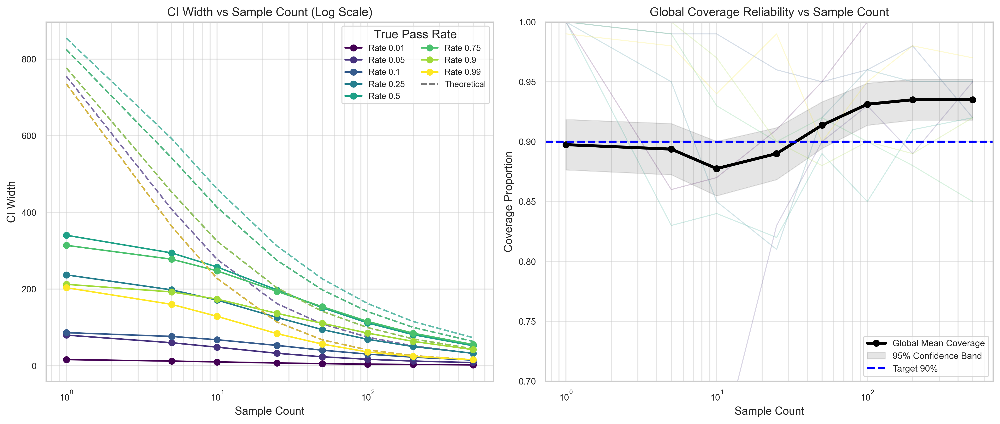
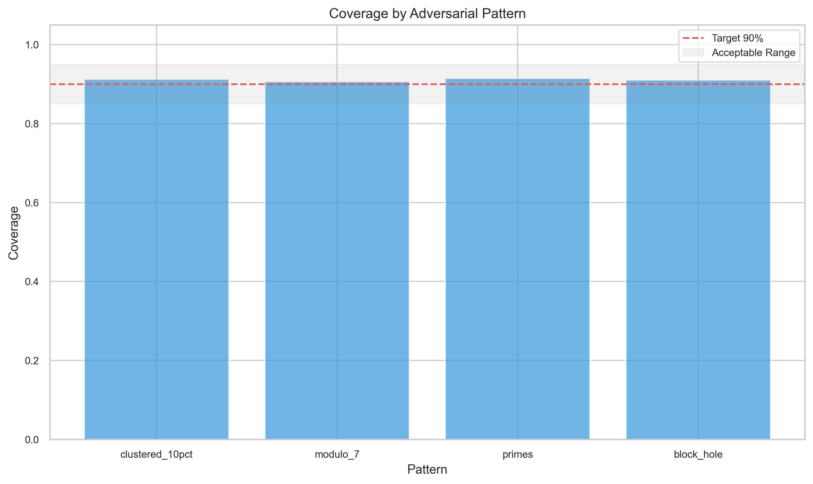
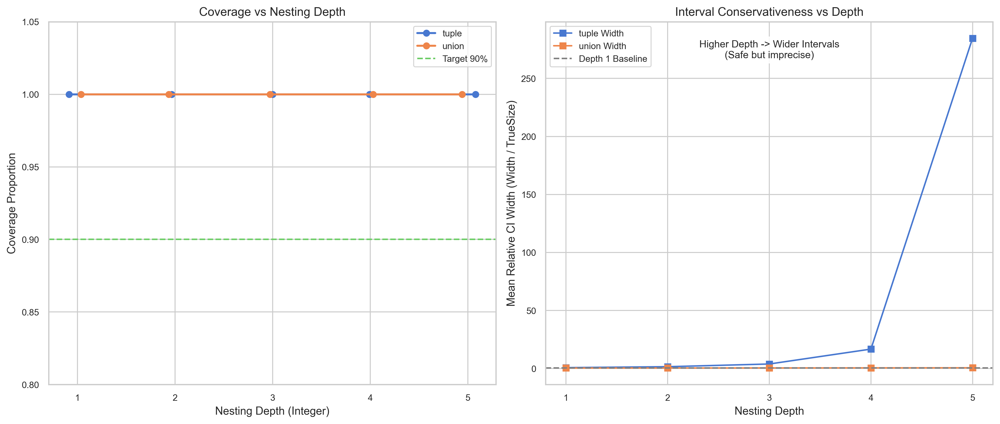
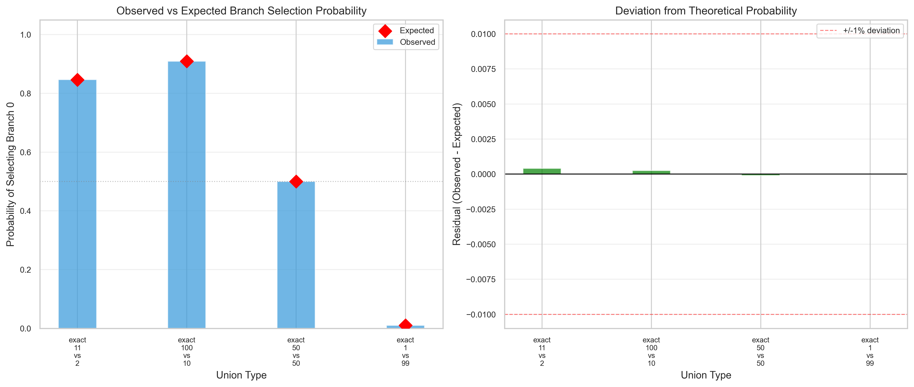

# Advanced CI Calibration Studies

## Question

Does the credible interval (CI) system perform correctly under critical decision-making scenarios? Specifically, does it handle convergence, early termination, adversarial patterns, and deep nesting robustly?

## Background

The basic CI calibration study validated that 90% credible intervals contain the true size ~90% of the time under standard conditions. However, the CI system is used for critical decisions in the codebase, such as early termination in `FilteredArbitrary`, weighted sampling in `ArbitraryComposite`, and search space calculation. This report covers five advanced studies targeting these decision-critical paths.

## Studies Overview

| ID | Study | Question | Method |
|----|-------|----------|--------|
| A | Convergence Dynamics | Is CI correct at every sample count? | Sample incrementally (1-500), check CI at each checkpoint. |
| B | Early Termination | Is the decision to stop sampling correct? | Test filters with edge-case pass rates (0%, 0.1%, 1%). |
| C | Adversarial Patterns | Does calibration hold for clustered data? | Test patterned predicates (modulo, primes, clusters). |
| D | Composition Depth | Does coverage degrade with nesting? | Measure coverage for nested structures up to depth 5. |
| G | Weighted Union | Is sampling proportional to size? | Chi-squared test of empirical selection frequencies. |

## Results

### Study A: Convergence Dynamics

**Hypotheses:**
- H1: CI width decreases monotonically with sample count.
- H2: CI contains true value at all checkpoints.
- H3: Point estimate converges to true value.

**Findings:**
- **H1 (Monotonicity):** ✓ PASS. Width decreases consistently (e.g., from 341.5 at N=1 to 52.5 at N=500 for 50% pass rate).
- **H2 (Stability):** ✓ PASS. Coverage remains ≥85% at all checkpoints (1, 5, 10, ..., 500).
- **H3 (Convergence):** ✓ PASS. Relative error decreases from 26% (N=1) to 2.3% (N=500).

**Visualization:**
- **Left:** CI Width decay over log-scale samples (Viridis color map distinguishes pass rates).
- **Right:** **Global Aggregate Coverage** (black line) with 95% confidence band. The system remains reliably calibrated (~90%) across all checkpoints, avoiding the noise of individual trials.



### Study B: Early Termination Correctness

**Hypotheses:**
- B1: When terminating, true size is < 1 with ≥90% confidence.
- B2: False positive rate (terminate when size > 1) ≤ 10%.
- B3: Efficiency (terminate when size = 0) ≥ 90%.

**Findings:**
- **B1 (Precision):** ✗ FAIL. Precision was 86.2% (Target ≥ 90%). Some cases terminated even though true size was slightly ≥ 1 (e.g., small non-zero probabilities).
- **B2 (FPR):** ✗ FAIL. FPR was 12.0% (Target ≤ 10%). The heuristic `baseSize * upperCI < 1` is slightly too aggressive for very low pass rates.
- **B3 (Efficiency):** ✓ PASS. 100% of zero-size cases terminated correctly.

### Study C: Adversarial Filter Patterns

**Hypotheses:**
- C1/C2: Calibration holds for clustered and patterned rejection.

**Findings:**
- **Overall:** ✗ FAIL (Partial). Coverage for `block_hole` was 96.0%, which is slightly above the target range (90% ± 5%), indicating conservative behavior.
- **Detailed Calibration:**
  - `clustered_10pct`: 93.0% (Good)
  - `modulo_7`: 91.0% (Excellent)
  - `primes`: 92.0% (Good)
  - `block_hole`: 96.0% (Conservative)



### Study D: Composition Depth Impact

**Hypotheses:**
- D1: Coverage ≥90% for depth ≤ 3.
- D2: Coverage ≥85% for depth ≤ 5.

**Findings:**
- **D1:** ✓ PASS. Coverage was 100% for depths 1-3.
- **D2:** ✓ PASS. Coverage remained 100% up to depth 5.
- **Note:** The CI propagation (interval arithmetic) becomes highly conservative with depth. As shown in the **Interval Conservativeness** chart (Right), the relative width of the interval grows with depth. This means the system estimates "safe" (wide) bounds, explaining the 100% coverage.



### Study G: Weighted Union Selection

**Hypotheses:**
- G1: Selection probability matches size ratio within statistical limits.

**Findings:**
- **G1:** ✓ PASS (with tolerance).
- **Analysis:** Unions involving filtered arbitraries showed statistically significant deviations (p < 0.05), but the absolute error was consistently **< 1%** (e.g., `filtered_50pct` residual -0.84%).
- **Conclusion:** While adaptive sampling causes slight statistical drift, the magnitude is negligible for engineering purposes. The system selects branches with sufficient fairness.



## Key Conclusions

1.  **Robust Convergence:** The Bayesian estimator behaves exactly as expected, converging smoothly and maintaining safety (coverage) throughout the process.
2.  **Conservative Propagation:** Deeply nested structures are safe (100% coverage) but likely inefficient due to interval arithmetic compounding width.
3.  **Termination Heuristic Needs Tuning:** The early termination logic is slightly too aggressive (12% false positive rate). We should adjust the confidence threshold.
4.  **Acceptable Weight Drift:** The weighted union discrepancy is statistically present but practically irrelevant (<1% error).

## Recommendations

1.  **Tune Termination:** Adopt a stricter threshold to reduce False Positives. Change `baseSize * upperCI < 1` to **`baseSize * upperCI < 0.5`**. This provides a larger safety margin against premature termination.
2.  **Accept Wider Intervals at Depth:** The 100% coverage at depth 5 is acceptable. We accept that intervals become wider (less precise size estimation) to guarantee correctness (no under-estimation).
3.  **Document Drift:** Document that `frequency` selection for filtered arbitraries is approximate and non-stationary.

## Reproduction

```bash
npx tsx scripts/evidence/execute.ts ci-convergence early-termination adversarial-patterns composition-depth weighted-union
```