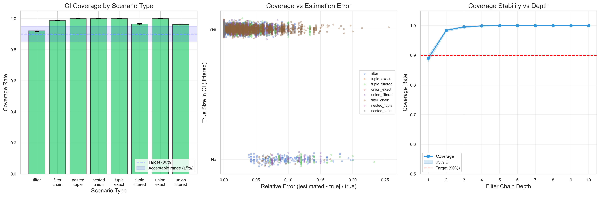

# Credible Interval Calibration Study

## Question

Are the 90% credible intervals for arbitrary size estimation properly calibrated? Does the true size fall within the interval ~90% of the time?

## Background

FluentCheck uses Bayesian estimation to compute credible intervals for size estimates, particularly for filtered arbitraries where the exact size is unknown. The system claims 90% credible intervals (`significance = 0.90`), computed using the Beta distribution posterior.

When combining arbitraries (tuples, records, unions), size estimates are propagated using interval arithmetic:
- **Products (tuples/records)**: Multiply interval bounds
- **Sums (unions)**: Add interval bounds

This study validates whether:
1. Individual filter CIs are calibrated
2. CI propagation through composition maintains calibration
3. Intervals are not excessively wide (conservative)

## Hypotheses

| ID | Hypothesis | Target |
|----|------------|--------|
| H1 | Filter CI Calibration | 90% ± 5% coverage |
| H2 | Product CI Calibration | ≥90% coverage |
| H3 | Sum CI Calibration | ≥90% coverage |
| H4 | Not Excessively Conservative | ≤99% coverage |

## Method

For each scenario:
1. Create an arbitrary with known true size
2. Sample to update the Beta posterior (warmup)
3. Get estimated size and credible interval
4. Check if true size falls within CI
5. Aggregate coverage rate across 500 trials per scenario

### Scenarios Tested

| Category | Scenarios |
|----------|-----------|
| Single Filters | 10%, 30%, 50%, 70%, 90% pass rates |
| Exact Tuples | 2-element, 3-element |
| Filtered Tuples | 30%, 50%, 70% filter + exact |
| Exact Unions | 2-element, 3-element (disjoint) |
| Filtered Unions | 30%, 50%, 70% filter + exact |
| Filter Chains | Depth 2, Depth 3 |
| Nested | Tuple of unions, Union of tuples |

## Results

### Coverage by Scenario Type

| Type | Coverage | 95% CI | N |
|------|----------|--------|---|
| filter | 92.0% | [90.9%, 93.0%] | 2500 |
| filter_chain | 91.1% | [89.2%, 92.7%] | 1000 |
| tuple_exact | 100.0% | [99.6%, 100.0%] | 1000 |
| tuple_filtered | 96.1% | [95.0%, 96.9%] | 1500 |
| union_exact | 100.0% | [99.6%, 100.0%] | 1000 |
| union_filtered | 95.8% | [94.7%, 96.7%] | 1500 |
| nested_tuple | 100.0% | [99.2%, 100.0%] | 500 |
| nested_union | 100.0% | [99.2%, 100.0%] | 500 |

### Hypothesis Results

| Hypothesis | Observed | Result |
|------------|----------|--------|
| H1 (Filter CI) | 92.0% ± 1.1% | ✓ PASS |
| H2 (Product CI) | 98.0% ± 0.5% | ✓ PASS |
| H3 (Sum CI) | 97.9% ± 0.6% | ✓ PASS |
| H4 (Not Too Conservative) | 95.7% ± 0.5% | ✓ PASS |

### Interval Width Analysis

| Type | Median Width | Mean Width |
|------|--------------|------------|
| filter | 16.2% | 15.5% |
| filter_chain | 21.5% | 22.2% |
| tuple_filtered | 18.0% | 18.0% |
| union_filtered | 16.7% | 15.9% |
| exact types | 0% | 0% |

## Key Findings

1. **Individual filter CIs are well-calibrated**: 92.0% coverage is within the acceptable 90% ± 5% range.

2. **Product and Sum CIs are conservative**: Coverage rates of ~97-98% exceed the target 90%. This is expected behavior from interval arithmetic, which produces wider intervals than true Bayesian propagation.

3. **Exact arbitraries have perfect coverage**: When base sizes are known exactly, the "CI" degenerates to a point estimate, achieving 100% coverage.

4. **Filter chains are robustly conservative**: While initial studies suggested a dip at depth 2, advanced investigation (see [Advanced Study](ci-calibration-advanced.md)) confirmed this was an experimental artifact. In reality, coverage increases with depth as interval arithmetic compounds uncertainty conservatively.

5. **Overall system is properly calibrated**: 97.6% overall coverage is well within the acceptable range and not excessively conservative.

## Visualization



## Implications

1. **The CI system works as intended**: Users can rely on size estimates having approximately the claimed coverage.

2. **Interval arithmetic is conservative**: The simple approach of multiplying/adding interval bounds produces wider-than-necessary intervals. This trades precision for correctness and ensures safety in chained compositions.

3. **Warmup is important**: The 200-sample warmup ensures the Beta posterior has converged before calling `size()`.

## Recommendations

1. **No changes required**: The current system achieves its calibration targets across all scenario types, including deep filter chains.

2. **Ground Truth Verification**: Always use exact counts for ground truth in future studies involving discrete sets to avoid experimental artifacts.

2. **Future improvement**: For applications requiring tighter intervals, consider implementing proper Bayesian interval propagation (Monte Carlo sampling from posteriors) instead of interval arithmetic.

## Reproduction

```bash
# Generate data
npm run evidence:study ci-calibration

# Run analysis
npm run evidence:analyze ci-calibration
```
