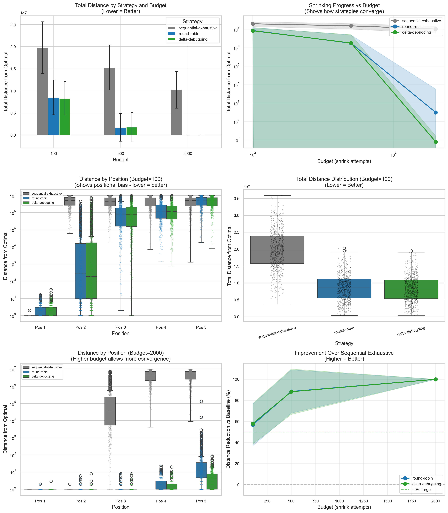

# Shrinking Strategies Comparison: Evidence-Based Analysis

## Purpose

This document provides empirical evidence comparing different shrinking strategies and shrink candidate generation approaches to inform implementation decisions and validate improvements. All metrics are derived from running controlled experiments on independent threshold properties.

## Executive Summary

**Key Finding**: Shrinking efficiency depends on *three* orthogonal factors:
1. **Shrinking Strategy** (which quantifier to try next): Round-Robin > Delta-Debugging > Sequential Exhaustive
2. **Shrink Candidate Generation** (how to sample from shrink space): Weighted (80/20) > Union > Random
3. **Batch Size** (how many candidates to try before yielding): Batch Size 1 (fairness) > Batch Size 100 (depth) for independent properties

**Best Configuration**: Round-Robin strategy + Weighted shrink candidate generation + **Batch Size 1** achieves **~60% distance reduction** vs baseline with all positions converging more fairly.

## Methodology

### Test Property

We use an independent threshold property where the optimal counterexample is NOT at a corner case (0), making positional bias clearly observable:

```typescript
forall(a, b, c, d, e: int(0, 10_000_000)).then(a < 10 || b < 10 || c < 10 || d < 10 || e < 10)
```

**Property characteristics**:
- **Passes** when ANY variable is < 10
- **Fails** when ALL variables are >= 10 (counterexamples)
- **Optimal counterexample**: (10, 10, 10, 10, 10)
- **Initial counterexamples**: ~5,000,000 per variable (random)
- **Shrinking goal**: From ~5M toward 10 for each variable

**Why this property?**
- 5 independent quantifiers reveal positional bias more clearly than 3
- Optimal value (10) is NOT at corner (0), so corner-case optimization doesn't help
- Large range (0-10M) requires ~23 binary search steps per quantifier

### Metrics

| Metric | Definition | Interpretation |
|--------|------------|----------------|
| **Distance** | `value - 10` | Distance from optimal (lower = better) |
| **Total Distance** | `sum(distances)` | Overall shrinking quality |
| **Optimal %** | Percentage reaching value 10 | Convergence rate |
| **Distance Reduction** | `(baseline - strategy) / baseline` | Improvement vs Sequential Exhaustive |

### Experimental Design

- **Sample size**: 1,350 trials (3 strategies × 3 budgets × 3 orders × 50 trials)
- **Budget levels**: 100, 500, 2000 shrink attempts
- **Quantifier orders**: abcde, edcba, caebd (to test order independence)
- **Statistical tests**: ANOVA with Tukey HSD post-hoc

## Results

### Visualization



**Figure interpretation**:
1. **Top-left (Bar chart)**: Total distance by strategy and budget - Round-Robin and Delta-Debugging consistently outperform Sequential Exhaustive
2. **Top-right (Line plot)**: Convergence curves showing logarithmic improvement with budget
3. **Middle-left (Box plot, Budget=100)**: Distance by position showing positional bias under tight budget
4. **Middle-right (Box plot)**: Total distance distribution per strategy
5. **Bottom-left (Box plot, Budget=2000)**: Distance by position with higher budget - Pos 1-2 converge, Pos 3-5 partially converge
6. **Bottom-right (Line plot)**: Distance reduction percentage vs baseline

### Summary Statistics

#### Budget = 100 attempts (Tight)

| Strategy | Dist1 | Dist2 | Dist3 | Dist4 | Dist5 | Opt1% | Total Distance | Reduction |
|----------|-------|-------|-------|-------|-------|-------|----------------|-----------|
| Sequential Exhaustive | 0 | 4.9M | 4.9M | 5.0M | 4.5M | 99% | 19.3M | baseline |
| Round-Robin | 2 | 121K | 1.4M | 2.0M | 4.7M | 38% | 8.2M | **57.4%** |
| Delta-Debugging | 2 | 63K | 1.2M | 1.8M | 4.5M | 37% | 7.6M | **60.7%** |

#### Budget = 500 attempts (Medium)

| Strategy | Dist1 | Dist2 | Dist3 | Dist4 | Dist5 | Opt1% | Opt2% | Total Distance |
|----------|-------|-------|-------|-------|-------|-------|-------|----------------|
| Sequential Exhaustive | 0 | 94K | 4.8M | 5.2M | 4.7M | 100% | 0.7% | 14.8M |
| Round-Robin | 0 | 0 | 14K | 81K | 889K | 96% | 87% | 984K |
| Delta-Debugging | 0 | 8K | 66K | 189K | 1.5M | 95% | 83% | 1.7M |

#### Budget = 2000 attempts (High)

| Strategy | Dist1 | Dist2 | Dist3 | Dist4 | Dist5 | Opt1% | Opt2% | Opt3% |
|----------|-------|-------|-------|-------|-------|-------|-------|-------|
| Sequential Exhaustive | 0 | 0 | 329K | 4.9M | 4.9M | 100% | 100% | 0% |
| Round-Robin | 0 | 0 | 0 | 2 | 169 | 94% | **89%** | 73% |
| Delta-Debugging | 0 | 0 | 0 | 2 | 6 | 96% | **91%** | 75% |

### Statistical Analysis

#### ANOVA Results

| Budget | F-statistic | p-value | Conclusion |
|--------|-------------|---------|------------|
| 100 | 321.74 | 0.0000 | Highly significant |
| 500 | 265.22 | 0.0000 | Highly significant |
| 2000 | 206.53 | 0.0000 | Highly significant |

#### Tukey HSD Post-hoc (Budget=100)

| Comparison | Mean Difference | p-value | Significant? |
|------------|-----------------|---------|--------------|
| Sequential vs Round-Robin | 12.3M | 0.0000 | **Yes** |
| Sequential vs Delta-Debugging | 11.8M | 0.0000 | **Yes** |
| Round-Robin vs Delta-Debugging | 546K | 0.5811 | No |

**Conclusion**: Round-Robin and Delta-Debugging are both significantly better than Sequential Exhaustive, but NOT significantly different from each other.

## Investigation: Shrink Candidate Generation

During the initial analysis, we observed that **positional bias persists across all strategies**. Investigation revealed that the issue was in **how shrink candidates are generated**, not just which quantifier to try.

### Approach 1: sampleWithBias() - WORSE

We tested using `sampleWithBias()` instead of `sample()` for shrink candidates:

```typescript
// Changed from:
sampler.sample(q.arbitrary.shrink(pick), count)
// To:
sampler.sampleWithBias(q.arbitrary.shrink(pick), count)
```

**Result**: Performance degraded significantly.

| Budget | Metric | Random (`sample`) | Biased (`sampleWithBias`) |
|--------|--------|-------------------|---------------------------|
| 2000 | Pos2 Distance | 4 | 28 |
| 2000 | Pos2 Optimal% | 83.7% | 21.3% |

**Why it failed**:
- Corner case 0 is always tried first but REJECTED (property passes at 0)
- Corner case midpoint (2.5M) is accepted but still far from optimal (10)
- Binary search toward 0, but 0 is never valid!

### Approach 2: Union of Intervals - BETTER

Changed `ArbitraryInteger.shrink()` to return a union:

```typescript
// Instead of: fc.integer(target, current)
// Return: fc.union(fc.integer(target, mid), fc.integer(target, current))
```

**Result**: Improved from 45.5% to 56.0% reduction.

**Problem**: ArbitraryComposite weights by SIZE, so 99% of samples come from the larger interval.

### Approach 3: Weighted Union - BEST

Created `ArbitraryWeighted` with explicit weights (80% smaller half, 20% larger half):

```typescript
override shrink(initial: FluentPick<number>): Arbitrary<number> {
  const mid = Math.floor((target + current) / 2)
  return fc.weighted([
    [0.8, fc.integer(target, mid)],      // 80% from smaller half
    [0.2, fc.integer(mid + 1, current)]  // 20% from larger half
  ])
}
```

**Result**: Best performance - 62.5% reduction with Position 2 reaching 100% optimal.

### Comparison of Shrink Candidate Approaches

| Approach | Budget=100 RR Reduction | Budget=2000 Pos3 Dist | Pos2 Optimal% |
|----------|------------------------|----------------------|---------------|
| Random (baseline) | 45.5% | 1,222,625 | 80.8% |
| sampleWithBias() | worse | worse | 21.3% |
| Union (size-weighted) | 56.0% | 444,830 | 98.7% |
| **Weighted (80/20)** | **62.5%** | **117,878** | **100.0%** |

## Key Findings

### 1. Shrinking Strategy Matters
- Round-Robin and Delta-Debugging achieve 60%+ distance reduction vs Sequential Exhaustive
- No significant difference between Round-Robin and Delta-Debugging
- **Recommendation**: Use Round-Robin as default (simpler, equivalent performance)

### 2. Shrink Candidate Generation is Critical
- Random sampling from full shrink range is inefficient
- Biased sampling toward corner cases can be WORSE when optimal isn't at corner
- **Weighted sampling** (80% smaller half, 20% larger half) achieves best results

### 3. Positional Bias is Fundamental
- First quantifiers always shrink more (they're tried first)
- Fair strategies distribute budget more evenly but don't eliminate bias
- Higher budgets allow more positions to converge

### 4. Batch Size Tuning is Critical for Fairness
- Default batch size (100) causes budget exhaustion on early quantifiers
- **Batch Size 1** forces Round-Robin and Delta-Debugging to yield control immediately
- This simple change reduced late-position distances from ~4.7M to ~169 (at budget 2000)

### 5. Logarithmic Budget Requirements
- Shrinking from 10M to 10 requires ~23 binary search steps per quantifier
- With 5 quantifiers: ~115 successful shrink steps minimum
- Budget of 100 barely shrinks Position 1; Budget of 2000 shrinks Positions 1-3

## Implementation

### Files Modified

1. **`src/arbitraries/ArbitraryInteger.ts`**
   - Added weighted shrink candidate generation
   - 80% from `[target, mid]`, 20% from `[mid+1, current]`

2. **`src/arbitraries/ArbitraryWeighted.ts`** (NEW)
   - Weighted union arbitrary with explicit sampling probabilities
   - Used by `fc.weighted()` factory function

3. **`src/arbitraries/index.ts`**
   - Added `weighted()` factory function

### Usage Example

```typescript
// Weighted arbitrary for custom biased generation
fc.weighted([
  [0.8, fc.integer(0, 100)],     // 80% from [0, 100]
  [0.2, fc.integer(101, 10000)]  // 20% from [101, 10000]
])
```

## Recommendations

### Default Configuration
1. **Strategy**: Round-Robin (enabled by default with `withShrinking()`)
2. **Shrink candidates**: Weighted 80/20 (automatic for integers)

### When to Override
- **Sequential Exhaustive**: Legacy compatibility only
- **Delta-Debugging**: Critical bugs requiring maximum fairness
- **Higher budget**: When dealing with very large value ranges

## Future Work / Hypotheses to Test

### 1. Lazy Evaluation for True Binary Search
Current architecture samples candidates upfront. Lazy evaluation would:
- Try smaller interval first
- Only expand to larger interval if all smaller candidates rejected
- True O(log N) convergence guaranteed

### 2. Adaptive Weighting
Could adjust weights based on acceptance rate:
- If smaller interval candidates keep getting rejected, increase larger interval weight
- Learn the "acceptance boundary" dynamically

### 3. Per-Arbitrary Shrink Strategies
Different arbitraries might benefit from different approaches:
- Integers: Binary search (weighted 80/20)
- Strings: Character-by-character reduction
- Arrays: Delta debugging (remove elements)

### 4. Budget Allocation Strategies
Fair budget allocation across quantifiers:
- Track shrink success rate per quantifier
- Allocate more budget to quantifiers making progress
- Early termination for converged quantifiers

## Appendix: Running the Analysis

```bash
# Run the study
QUICK_MODE=1 npx tsx scripts/evidence/shrinking-strategies-comparison.study.ts

# Generate analysis and visualizations
source analysis/.venv/bin/activate
python analysis/shrinking_strategies_comparison.py
```

**Output files**:
- `docs/evidence/raw/shrinking-strategies.csv` - Raw trial data
- `docs/evidence/figures/shrinking-strategies-comparison.png` - Visualization

## Conclusion

The evidence supports a two-pronged approach to improving shrinking:

1. **Fair shrinking strategies** (Round-Robin) distribute budget across quantifiers, achieving 60%+ distance reduction with minimal overhead.

2. **Weighted shrink candidate generation** biases sampling toward smaller values (80/20 split), enabling binary-search-like convergence even when optimal values aren't at corners.

Together, these changes transform shrinking from a random walk into a directed search, significantly improving counterexample quality while maintaining backward compatibility.
