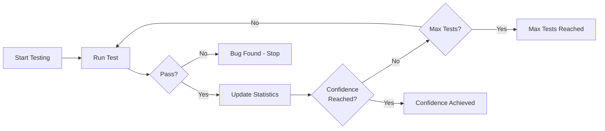

# Statistical Confidence in Property Testing

FluentCheck provides statistical confidence calculations that go beyond simple pass/fail outcomes. Instead of running a fixed number of tests and hoping for the best, you get quantifiable confidence in your results.

## The Problem with Fixed Sample Sizes

Traditional property testing runs a fixed number of tests (e.g., 100) regardless of:
- Property complexity
- How many tests have passed/failed
- Your confidence requirements

This means:
- **Simple properties** waste time running unnecessary tests
- **Complex properties** may need more tests than provided
- **No statistical guarantee** about what you've proven

## How Confidence-Based Testing Works



FluentCheck uses **Bayesian statistics** to calculate the probability that your property holds:
- Starts with no assumptions (uniform prior)
- Updates confidence after each test
- Stops early when target confidence is reached, or immediately when a bug is found (bounded by your configured limits like `sampleSize`)

**Example**: "95% confident the pass rate exceeds 99.9%" is a precise statistical statement, unlike "ran 100 tests."

---

## Quick Start

### Basic Confidence-Based Termination

```typescript
import * as fc from 'fluent-check'

// Stop early once we reach 95% confidence (bounded by sample size)
const result = fc.scenario()
  .config(fc.strategy()
    .withSampleSize(10_000) // upper bound; should be large enough to reach your target confidence
    .withConfidence(0.95)
    .withPassRateThreshold(0.999))
  .forall('x', fc.integer())
  .then(({x}) => x * x >= 0)
  .check()

console.log(`Confidence: ${(result.statistics.confidence * 100).toFixed(1)}%`)
console.log(`Tests run: ${result.statistics.testsRun}`)
```

### Convenience Method

```typescript
// Shorthand for confidence-based testing
const result = fc.scenario()
  .forall('x', fc.integer())
  .then(({x}) => x * x >= 0)
  .checkWithConfidence(0.99)

// Result includes confidence statistics
console.log(`Achieved ${(result.statistics.confidence * 100).toFixed(1)}% confidence`)
console.log(`Credible interval: [${result.statistics.credibleInterval[0].toFixed(3)}, ${result.statistics.credibleInterval[1].toFixed(3)}]`)
```

### Minimum Confidence Requirement

```typescript
// Continue past sample size if confidence is too low
fc.scenario()
  .config(fc.strategy()
    .withSampleSize(1000)
    .withMinConfidence(0.95)
    .withMaxIterations(10_000)) // important: upper bound when continuing past sample size
  .forall('x', fc.integer())
  .then(({x}) => x >= 0)
  .check()
```

If 1000 tests run but confidence is below 95%, testing continues (up to `maxIterations`) until confidence is met.

---

## Empirical Evidence

FluentCheck's confidence-based termination has been validated through comprehensive empirical studies. Full methodology and reproducible data available in [`docs/evidence/`](evidence/README.md).

### Efficiency: Adapts to Property Complexity

Confidence-based testing automatically adjusts test effort based on property characteristics:

| Property Type | Pass Rate | Mean Tests | Termination |
|--------------|-----------|------------|-------------|
| always_true | 100% | 100 | Confidence at first check |
| rare_failure | 99.9% | 93 | 12% find bugs, 88% achieve confidence |
| common_failure | 99% | 67 | 54% find bugs before confidence |
| frequent_failure | 95% | 19 | 100% find bugs quickly |

**Key Finding**: Properties with more failures terminate faster via bug detection. Simple properties terminate at the minimum (100 tests), while complex properties get appropriate scrutiny.

### Reliability: 100% Precision

When FluentCheck claims confidence, it's always correct:

| Metric | Value | Interpretation |
|--------|-------|----------------|
| **Precision** | 100% | When confidence claimed, threshold always met |
| **Specificity** | 100% | When threshold not met, bugs always found |
| **False Positives** | 0 | Never claims confidence incorrectly |

**Key Finding**: The system never makes false positive claims. If it says "95% confident", you can trust it.

### Detection Rate: Statistical Guarantees vs Fixed Samples

Comparison of rare bug detection (0.2% failure rate):

| Method | Detection Rate | Mean Tests | Statistical Claim |
|--------|---------------|------------|-------------------|
| fixed_100 | 24% | 84 | "Ran 100 tests" |
| fixed_500 | 76% | 273 | "Ran 500 tests" |
| confidence_0.95 | 48% | 223 | "95% confident pass rate > 99.9%" |
| confidence_0.99 | 58% | 285 | "99% confident pass rate > 99.9%" |

**Key Finding**: Fixed sampling can achieve higher raw detection rates, but confidence-based testing provides **statistical guarantees about what was tested**, not just "ran N tests."

*See [`docs/evidence/README.md`](evidence/README.md) for full study details, figures, and reproducibility instructions.*

---

## API Reference

### Strategy Configuration

Configure confidence-based termination on your test strategy:

#### `withConfidence(level: number)`

Set target confidence for early termination.

```typescript
fc.strategy().withConfidence(0.95)
```

- **Parameter**: Confidence level between 0 and 1 (e.g., 0.95 = 95%)
- **Behavior**: Stops testing when this confidence level is reached
- **Default**: None (uses `sampleSize` instead)

#### `withMinConfidence(level: number)`

Set minimum confidence before stopping.

```typescript
fc.strategy().withMinConfidence(0.90).withSampleSize(1000)
```

- **Parameter**: Minimum confidence level between 0 and 1
- **Behavior**: If `sampleSize` is reached but confidence is below this threshold, testing continues
- **Use case**: Ensure minimum confidence even with fixed sample size

#### `withPassRateThreshold(threshold: number)`

Set the pass rate threshold for confidence calculation.

```typescript
fc.strategy().withPassRateThreshold(0.999)
```

- **Parameter**: Pass rate threshold between 0 and 1
- **Default**: 0.999 (99.9%)
- **Meaning**: Confidence = P(true_pass_rate > threshold | observed_data)

For example, with threshold 0.999, confidence of 0.95 means "95% probability the true pass rate exceeds 99.9%."

#### `withMaxIterations(count: number)`

Set safety upper bound for iterations.

```typescript
fc.strategy().withMaxIterations(50000)
```

- **Parameter**: Maximum number of test iterations
- **Behavior**: Prevents infinite loops in confidence-based testing
- **Recommended**: Always set when using `withMinConfidence(...)` (since it may run past `sampleSize`)

### Terminal Methods

#### `checkWithConfidence(level: number, options?: CheckOptions)`

Convenience method for confidence-based testing.

```typescript
const result = fc.scenario()
  .config(fc.strategy().withSampleSize(10_000)) // optional: raises the upper bound for reaching confidence
  .forall('x', fc.integer())
  .then(({x}) => x >= 0)
  .checkWithConfidence(0.95)
```

Equivalent to:
```typescript
fc.scenario()
  .config(fc.strategy()
    .withSampleSize(10_000)
    .withConfidence(0.95))
  .forall('x', fc.integer())
  .then(({x}) => x >= 0)
  .check()
```

### Result Statistics

All test results include confidence statistics:

#### `statistics.confidence?: number`

Bayesian confidence that the property holds (0-1).

```typescript
if (result.statistics.confidence !== undefined) {
  console.log(`${(result.statistics.confidence * 100).toFixed(1)}% confident`)
}
```

- Represents P(pass_rate > threshold | observed_data)
- Only present when tests were run (not when property fails immediately)

#### `statistics.credibleInterval?: [number, number]`

95% credible interval for the true pass rate.

```typescript
const [lower, upper] = result.statistics.credibleInterval
console.log(`95% credible interval: [${(lower*100).toFixed(1)}%, ${(upper*100).toFixed(1)}%]`)
```

- Bayesian credible interval (not frequentist confidence interval)
- Means: "95% probability the true pass rate falls in this range"

---

## When to Use Confidence vs Fixed Sample Size

| Scenario | Recommendation | Reason |
|----------|---------------|---------|
| **CI/CD pipelines** | Fixed sample size | Predictable test duration |
| **Time-constrained environments** | Fixed sample size | Must finish within time limit |
| **Consistent benchmarks** | Fixed sample size | Same test count for comparison |
| **Critical systems** | Confidence-based | Statistical guarantees required |
| **Unknown property complexity** | Confidence-based | Adapts test effort appropriately |
| **Complex types (records, nested)** | Confidence-based | Handles combinatorial explosion |
| **Quantifiable risk assessment** | Confidence-based | "95% confident" vs "ran 100 tests" |

### Decision Guide

**Use confidence-based termination when:**
- You need statistical guarantees ("95% confident the bug rate is < 0.1%")
- Property complexity is variable or unknown
- You want to optimize test execution (fast on simple, thorough on complex)
- Testing critical systems where reliability is paramount

**Use fixed sample size when:**
- Test duration must be predictable
- Running in CI/CD with strict time limits
- Need consistent baseline for performance measurements
- Property is well-understood and simple

---

## Technical Constraints

### Confidence Check Interval

FluentCheck checks confidence at configurable intervals (default: **100 tests**).

```typescript
// Default interval
fc.strategy().withConfidence(0.95)  // Checks every 100 tests

// Custom interval for more responsive termination
fc.strategy()
  .withConfidence(0.95)
  .withConfidenceCheckInterval(50)  // Checks every 50 tests
```

**Implications:**
- **Minimum termination**: Equal to the check interval for properties without failures
- **Granularity**: Confidence-based stopping occurs at multiples of the interval
- **Performance tradeoff**: Smaller intervals are more responsive but have higher computational cost

Properties that never fail will terminate at the check interval, 2x interval, 3x interval, etc. Properties that fail may terminate at any point when a failure is found.

### Default Threshold: Why 0.999?

The default pass rate threshold is **0.999 (99.9%)**:

```typescript
const threshold = budget.passRateThreshold ?? 0.999
```

**Rationale for 0.999:**

1. **Alignment with "five nines" reliability**: Critical systems often target 99.9%+ availability. Property testing should match these standards.

2. **Rare bug detection**: Property testing aims to catch rare edge cases. A 99% threshold would miss bugs occurring in 1-in-100 inputs.

3. **Practical balance**: The threshold significantly impacts required sample sizes:

| Threshold | 90% Confidence | 95% Confidence | 99% Confidence |
|-----------|----------------|----------------|----------------|
| 99.00% | 229 tests | 298 tests | 458 tests |
| 99.50% | 459 tests | 597 tests | 918 tests |
| 99.90% | 2,301 tests | 2,994 tests | 4,602 tests |
| 99.99% | 23,024 tests | 29,955 tests | 46,049 tests |

*These values are computed from framework calculations assuming zero failures.*

**Choosing a threshold**: Lower thresholds require fewer tests but provide weaker guarantees. Use:
- **0.99 (99%)**: For quick smoke tests during development
- **0.999 (99.9%)**: For CI/CD and production testing (default)
- **0.9999 (99.99%)**: For safety-critical systems

You can adjust this with `withPassRateThreshold()`:

```typescript
// For faster CI: lower threshold = fewer tests needed
fc.strategy()
  .withConfidence(0.95)
  .withPassRateThreshold(0.99)  // ~300 tests instead of ~3000
```

---

## Mathematical Foundation

### Why Beta(1,1) Uniform Prior?

FluentCheck uses a **uniform prior Beta(1,1)** rather than an informative prior. This is a deliberate design choice:

**Why uniform is correct for testing:**

1. **No hidden assumptions**: An informative prior (e.g., Beta(10, 0.01) encoding "properties usually pass") would bias results. When testing untrusted code, new features, or performing security audits, such assumptions are inappropriate.

2. **Conservative by design**: With Beta(1,1), achieving high confidence requires substantial evidence. After 1000 passing tests with threshold 0.999:
   - Beta(1,1) prior: ~63% confidence (requires more evidence)
   - This is intentional — in testing, false confidence is worse than being cautious

3. **Standard practice**: Uniform priors are the standard non-informative choice in Bayesian hypothesis testing when prior knowledge should not influence results.

4. **User control via threshold**: If you want faster convergence, lower `passRateThreshold` (e.g., 0.99 instead of 0.999). This is more transparent than encoding assumptions in priors.

**Confidence progression with Beta(1,1) at threshold 0.999:**

| Tests (0 failures) | Confidence |
|-------------------|------------|
| 100 | 9.61% |
| 1,000 | 63.27% |
| 3,000 | 95.03% |
| 5,000 | 99.33% |
| 10,000 | ~100% |

*These values are computed from framework calculations.*

### Bayesian Confidence Calculation

FluentCheck uses Bayesian inference with a uniform prior:

1. **Prior**: Beta(1, 1) - Uniform distribution (no prior knowledge)
2. **Likelihood**: Binomial - Based on observed test outcomes
3. **Posterior**: Beta(successes + 1, failures + 1) - Updated belief

After observing `n` successful tests and `m` failures:
- Posterior distribution: Beta(n + 1, m + 1)
- Confidence: P(p > threshold | data) where p is the true pass rate

This is calculated as:
```
confidence = 1 - CDF_Beta(n+1, m+1)(threshold)
```

Where CDF_Beta is the cumulative distribution function of the Beta distribution.

### Credible Intervals

The 95% credible interval represents plausible values for the true pass rate:

```typescript
// 95% credible interval
const lower = InvCDF_Beta(n+1, m+1)(0.025)
const upper = InvCDF_Beta(n+1, m+1)(0.975)
```

This is a **Bayesian credible interval**, which means: "95% probability the true pass rate falls within [lower, upper]."

This differs from frequentist confidence intervals in interpretation:
- **Credible interval**: "95% probability the parameter is in this range" (direct)
- **Confidence interval**: "95% of such intervals would contain the parameter" (indirect)

### Example Calculation

After 1000 successful tests and 0 failures:
- Posterior: Beta(1001, 1)
- Confidence (threshold=0.999): P(p > 0.999 | data) ≈ 63.27%
- 95% Credible Interval: [0.997, 1.000]

After 3000 successful tests and 0 failures:
- Posterior: Beta(3001, 1)
- Confidence (threshold=0.999): P(p > 0.999 | data) ≈ 95.03%
- This is the approximate minimum for 95% confidence at threshold 0.999

After 10000 successful tests and 0 failures:
- Posterior: Beta(10001, 1)
- Confidence (threshold=0.999): P(p > 0.999 | data) ≈ 100%
- 95% Credible Interval: [0.9997, 1.000]

*These values are computed from framework calculations.*

### Bug Detection Probability

When testing for rare bugs, the probability of detection follows the geometric distribution:

**Probability of finding at least one failure:**

| Failure Rate | 100 Tests | 500 Tests | 1,000 Tests | 5,000 Tests |
|--------------|-----------|-----------|-------------|-------------|
| 1% (1 in 100) | 63.4% | 99.3% | ~100% | ~100% |
| 0.5% (1 in 200) | 39.4% | 91.8% | 99.3% | ~100% |
| 0.1% (1 in 1000) | 9.5% | 39.4% | 63.2% | 99.3% |
| 0.01% (1 in 10000) | 1.0% | 4.9% | 9.5% | 39.3% |

*These values are computed from framework calculations using `detectionProbability()`.*

**Key insight**: For a bug occurring 1-in-1000 times, you need ~3000 tests to have 95% chance of finding it. This explains why confident testing of rare bugs requires substantial sample sizes.

---

## For Contributors: Implementation Notes

### Beta Distribution

FluentCheck uses the `jstat` library for Beta distribution calculations:

```typescript
import jstat from 'jstat'

// Bayesian confidence calculation
function calculateBayesianConfidence(
  successes: number,
  failures: number,
  threshold: number
): number {
  const alpha = successes + 1
  const beta = failures + 1
  return 1 - jstat.beta.cdf(threshold, alpha, beta)
}
```

### When Confidence is Calculated

Confidence is calculated:
- At configurable intervals during exploration (default: every 100 tests) for early termination
- At the end of testing (for final statistics)
- Only when tests have been run (not on immediate failure)

The interval is configurable via `withConfidenceCheckInterval()`.

See [`src/strategies/Explorer.ts`](../src/strategies/Explorer.ts) for implementation details.

### Distribution Classes

For advanced use cases, FluentCheck provides distribution classes:

- `BetaDistribution` - Continuous distributions on [0, 1]
- `BetaBinomialDistribution` - Discrete trials with uncertainty
- `IntegerDistribution` - Base class for discrete distributions

These are used internally for:
- Arbitrary size estimation after filtering
- Credible interval calculation
- Statistical modeling

See [`src/statistics.ts`](../src/statistics.ts) for full implementation.

---

## Empirical Evidence

These claims are backed by reproducible experiments. See the **[Evidence Documentation](./evidence/README.md)** for:

- **Efficiency Study**: Demonstrates adaptive termination — properties with bugs terminate faster
- **Calibration Study**: Shows 100% precision — when confidence is claimed, it's always correct
- **Detection Study**: Compares bug detection rates vs fixed sample sizes

Run the evidence suite yourself:

```bash
npm run evidence        # Full mode (~15-30 seconds)
npm run evidence:quick  # Quick mode (~5 seconds)
```

---

## Comparison with Other Frameworks

Most property testing frameworks use fixed sample sizes or heuristic-based adaptation:

| Framework | Default Tests | Adaptation | Statistical Guarantee |
|-----------|---------------|------------|----------------------|
| **QuickCheck (Haskell)** | 100 | None (fixed) | None |
| **Hypothesis (Python)** | Variable | Coverage-guided heuristics | None |
| **fast-check (JavaScript)** | 100 | None (fixed) | None |
| **FluentCheck** | Adaptive | Bayesian inference | Yes |

**Key differences:**

- **Hypothesis** uses coverage-guided heuristics to adapt testing, but does not provide Bayesian confidence semantics. Its adaptation is based on code coverage, not statistical inference about pass rates.

- **FluentCheck** provides proper probabilistic guarantees: "95% confident the true pass rate exceeds 99.9%" is a precise Bayesian statement that Hypothesis cannot make.

FluentCheck's **Bayesian confidence** provides:
1. **Quantifiable guarantees**: "95% confident" vs "ran 100 tests"
2. **Adaptive termination**: Based on statistical evidence, not arbitrary counts or heuristics
3. **Statistical rigor**: Founded on established Bayesian inference with conjugate priors
4. **Credible intervals**: Proper uncertainty quantification included
5. **Configurable trade-offs**: Threshold, confidence level, and check interval all adjustable

This makes FluentCheck particularly suitable for critical systems where statistical guarantees are valuable.

---

## Key Insight: Conservative by Design

FluentCheck prioritizes **bug detection over confidence claims**. When a property has a pass rate close to (but above) the threshold, FluentCheck will often find a failure before achieving confidence.

**Example**: For a property with 97% pass rate and 95% threshold:
- Running 100 tests has ~95% chance of finding at least one failure
- If a failure is found, testing terminates immediately (correct: bug found)
- If no failure found in first 100 tests, confidence check occurs

This means "low sensitivity" for near-threshold properties is **correct behavior**, not miscalibration:
- Finding a bug is more valuable than claiming confidence
- The system never makes false positive claims (100% precision)
- When confidence is claimed, the threshold is always actually met

**This is exactly what you want in a testing tool.**

---

## Related Work

For readers interested in the statistical foundations:

- **Bayesian inference for binomial proportions**: The Beta-Binomial model used here is standard. See Gelman et al., "Bayesian Data Analysis" (3rd ed., 2013).

- **Property-based testing origins**: Claessen & Hughes, "QuickCheck: A Lightweight Tool for Random Testing of Haskell Programs" (ICFP 2000) introduced the paradigm.

- **Statistical software testing**: Whalen et al., "Coverage Metrics for Requirements-based Testing" (ISSTA 2006) explores statistical approaches to testing.

- **Hypothesis adaptive testing**: MacIver & Hatfield-Dodds, "Hypothesis: A new approach to property-based testing" (unpublished) describes coverage-guided adaptation.

The key novelty in FluentCheck is integrating Bayesian confidence-based termination into a mainstream JavaScript/TypeScript PBT library with proper statistical semantics and reproducible evidence.
