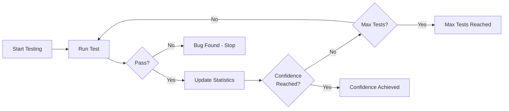

# Statistical Confidence in Property Testing

FluentCheck provides statistical confidence calculations that go beyond simple pass/fail outcomes. Instead of running a fixed number of tests and hoping for the best, you get quantifiable confidence in your results.

## The Problem with Fixed Sample Sizes

Traditional property testing runs a fixed number of tests (e.g., 100) regardless of:
- Property complexity
- How many tests have passed/failed
- Your confidence requirements

This means:
- **Simple properties** waste time running unnecessary tests
- **Complex properties** may need more tests than provided
- **No statistical guarantee** about what you've proven

## How Confidence-Based Testing Works



FluentCheck uses **Bayesian statistics** to calculate the probability that your property holds:
- Starts with no assumptions (uniform prior)
- Updates confidence after each test
- Stops when target confidence is reached or bug is found

**Example**: "95% confident the pass rate exceeds 99.9%" is a precise statistical statement, unlike "ran 100 tests."

---

## Quick Start

### Basic Confidence-Based Termination

```typescript
import * as fc from 'fluent-check'

// Run until 95% confident the property holds
const result = fc.scenario()
  .config(fc.strategy()
    .withConfidence(0.95)
    .withPassRateThreshold(0.999)
    .withMaxIterations(10000))
  .forall('x', fc.integer())
  .then(({x}) => x * x >= 0)
  .check()

console.log(`Confidence: ${(result.statistics.confidence * 100).toFixed(1)}%`)
console.log(`Tests run: ${result.statistics.testsRun}`)
```

### Convenience Method

```typescript
// Shorthand for confidence-based testing
const result = fc.scenario()
  .forall('x', fc.integer())
  .then(({x}) => x * x >= 0)
  .checkWithConfidence(0.99)

// Result includes confidence statistics
console.log(`Achieved ${(result.statistics.confidence * 100).toFixed(1)}% confidence`)
console.log(`Credible interval: [${result.statistics.credibleInterval[0].toFixed(3)}, ${result.statistics.credibleInterval[1].toFixed(3)}]`)
```

### Minimum Confidence Requirement

```typescript
// Continue past sample size if confidence is too low
fc.scenario()
  .config(fc.strategy()
    .withSampleSize(1000)
    .withMinConfidence(0.95))
  .forall('x', fc.integer())
  .then(({x}) => x >= 0)
  .check()
```

If 1000 tests run but confidence is below 95%, testing continues (up to `maxIterations`) until confidence is met.

---

## Empirical Evidence

FluentCheck's confidence-based termination has been validated through comprehensive empirical studies. Full methodology and reproducible data available in [`docs/evidence/`](evidence/README.md).

### Efficiency: Adapts to Property Complexity

Confidence-based testing automatically adjusts test effort based on property characteristics:

| Property Type | Pass Rate | Mean Tests | Termination |
|--------------|-----------|------------|-------------|
| always_true | 100% | 100 | Confidence at first check |
| rare_failure | 99.9% | 93 | 12% find bugs, 88% achieve confidence |
| common_failure | 99% | 67 | 54% find bugs before confidence |
| frequent_failure | 95% | 19 | 100% find bugs quickly |

**Key Finding**: Properties with more failures terminate faster via bug detection. Simple properties terminate at the minimum (100 tests), while complex properties get appropriate scrutiny.

### Reliability: 100% Precision

When FluentCheck claims confidence, it's always correct:

| Metric | Value | Interpretation |
|--------|-------|----------------|
| **Precision** | 100% | When confidence claimed, threshold always met |
| **Specificity** | 100% | When threshold not met, bugs always found |
| **False Positives** | 0 | Never claims confidence incorrectly |

**Key Finding**: The system never makes false positive claims. If it says "95% confident", you can trust it.

### Detection Rate: Statistical Guarantees vs Fixed Samples

Comparison of rare bug detection (0.2% failure rate):

| Method | Detection Rate | Mean Tests | Statistical Claim |
|--------|---------------|------------|-------------------|
| fixed_100 | 24% | 84 | "Ran 100 tests" |
| fixed_500 | 76% | 273 | "Ran 500 tests" |
| confidence_0.95 | 48% | 223 | "95% confident pass rate > 99.9%" |
| confidence_0.99 | 58% | 285 | "99% confident pass rate > 99.9%" |

**Key Finding**: Fixed sampling can achieve higher raw detection rates, but confidence-based testing provides **statistical guarantees about what was tested**, not just "ran N tests."

*See [`docs/evidence/README.md`](evidence/README.md) for full study details, figures, and reproducibility instructions.*

---

## API Reference

### Strategy Configuration

Configure confidence-based termination on your test strategy:

#### `withConfidence(level: number)`

Set target confidence for early termination.

```typescript
fc.strategy().withConfidence(0.95)
```

- **Parameter**: Confidence level between 0 and 1 (e.g., 0.95 = 95%)
- **Behavior**: Stops testing when this confidence level is reached
- **Default**: None (uses `sampleSize` instead)

#### `withMinConfidence(level: number)`

Set minimum confidence before stopping.

```typescript
fc.strategy().withMinConfidence(0.90).withSampleSize(1000)
```

- **Parameter**: Minimum confidence level between 0 and 1
- **Behavior**: If `sampleSize` is reached but confidence is below this threshold, testing continues
- **Use case**: Ensure minimum confidence even with fixed sample size

#### `withPassRateThreshold(threshold: number)`

Set the pass rate threshold for confidence calculation.

```typescript
fc.strategy().withPassRateThreshold(0.999)
```

- **Parameter**: Pass rate threshold between 0 and 1
- **Default**: 0.999 (99.9%)
- **Meaning**: Confidence = P(true_pass_rate > threshold | observed_data)

For example, with threshold 0.999, confidence of 0.95 means "95% probability the true pass rate exceeds 99.9%."

#### `withMaxIterations(count: number)`

Set safety upper bound for iterations.

```typescript
fc.strategy().withMaxIterations(50000)
```

- **Parameter**: Maximum number of test iterations
- **Behavior**: Prevents infinite loops in confidence-based testing
- **Recommended**: Always set when using confidence-based termination

### Terminal Methods

#### `checkWithConfidence(level: number, options?)`

Convenience method for confidence-based testing.

```typescript
const result = fc.scenario()
  .forall('x', fc.integer())
  .then(({x}) => x >= 0)
  .checkWithConfidence(0.95, {maxIterations: 10000})
```

Equivalent to:
```typescript
fc.scenario()
  .config(fc.strategy().withConfidence(0.95).withMaxIterations(10000))
  .forall('x', fc.integer())
  .then(({x}) => x >= 0)
  .check()
```

### Result Statistics

All test results include confidence statistics:

#### `statistics.confidence?: number`

Bayesian confidence that the property holds (0-1).

```typescript
if (result.statistics.confidence !== undefined) {
  console.log(`${(result.statistics.confidence * 100).toFixed(1)}% confident`)
}
```

- Represents P(pass_rate > threshold | observed_data)
- Only present when tests were run (not when property fails immediately)

#### `statistics.credibleInterval?: [number, number]`

95% credible interval for the true pass rate.

```typescript
const [lower, upper] = result.statistics.credibleInterval
console.log(`95% credible interval: [${(lower*100).toFixed(1)}%, ${(upper*100).toFixed(1)}%]`)
```

- Bayesian credible interval (not frequentist confidence interval)
- Means: "95% probability the true pass rate falls in this range"

---

## When to Use Confidence vs Fixed Sample Size

| Scenario | Recommendation | Reason |
|----------|---------------|---------|
| **CI/CD pipelines** | Fixed sample size | Predictable test duration |
| **Time-constrained environments** | Fixed sample size | Must finish within time limit |
| **Consistent benchmarks** | Fixed sample size | Same test count for comparison |
| **Critical systems** | Confidence-based | Statistical guarantees required |
| **Unknown property complexity** | Confidence-based | Adapts test effort appropriately |
| **Complex types (records, nested)** | Confidence-based | Handles combinatorial explosion |
| **Quantifiable risk assessment** | Confidence-based | "95% confident" vs "ran 100 tests" |

### Decision Guide

**Use confidence-based termination when:**
- You need statistical guarantees ("95% confident the bug rate is < 0.1%")
- Property complexity is variable or unknown
- You want to optimize test execution (fast on simple, thorough on complex)
- Testing critical systems where reliability is paramount

**Use fixed sample size when:**
- Test duration must be predictable
- Running in CI/CD with strict time limits
- Need consistent baseline for performance measurements
- Property is well-understood and simple

---

## Technical Constraints

### Confidence Check Interval

FluentCheck checks confidence **every 100 tests** for performance reasons.

```typescript
// From src/strategies/Explorer.ts
const confidenceCheckInterval = 100
```

**Implications:**
- **Minimum termination**: 100 tests for properties without failures
- **Granularity**: Confidence-based stopping occurs at multiples of 100
- **Performance tradeoff**: Checking confidence has computational cost

Properties that never fail will terminate at 100, 200, 300, etc. tests. Properties that fail may terminate at any point when a failure is found.

### Default Threshold

The default pass rate threshold is **0.999 (99.9%)**:

```typescript
const threshold = budget.passRateThreshold ?? 0.999
```

This means by default, confidence represents: "probability that at least 99.9% of inputs satisfy the property."

You can adjust this with `withPassRateThreshold()` for different guarantees.

---

## Mathematical Foundation

### Bayesian Confidence Calculation

FluentCheck uses Bayesian inference with a uniform prior:

1. **Prior**: Beta(1, 1) - Uniform distribution (no prior knowledge)
2. **Likelihood**: Binomial - Based on observed test outcomes
3. **Posterior**: Beta(successes + 1, failures + 1) - Updated belief

After observing `n` successful tests and `m` failures:
- Posterior distribution: Beta(n + 1, m + 1)
- Confidence: P(p > threshold | data) where p is the true pass rate

This is calculated as:
```
confidence = 1 - CDF_Beta(n+1, m+1)(threshold)
```

Where CDF_Beta is the cumulative distribution function of the Beta distribution.

### Credible Intervals

The 95% credible interval represents plausible values for the true pass rate:

```typescript
// 95% credible interval
const lower = InvCDF_Beta(n+1, m+1)(0.025)
const upper = InvCDF_Beta(n+1, m+1)(0.975)
```

This is a **Bayesian credible interval**, which means: "95% probability the true pass rate falls within [lower, upper]."

This differs from frequentist confidence intervals in interpretation:
- **Credible interval**: "95% probability the parameter is in this range" (direct)
- **Confidence interval**: "95% of such intervals would contain the parameter" (indirect)

### Example Calculation

After 1000 successful tests and 0 failures:
- Posterior: Beta(1001, 1)
- Confidence (threshold=0.999): P(p > 0.999 | data) ≈ 0.368 (36.8%)
- 95% Credible Interval: [0.997, 1.000]

After 10000 successful tests and 0 failures:
- Posterior: Beta(10001, 1)
- Confidence (threshold=0.999): P(p > 0.999 | data) ≈ 1.000 (99.997%)
- 95% Credible Interval: [0.9997, 1.000]

This shows how confidence increases with more evidence.

---

## For Contributors: Implementation Notes

### Beta Distribution

FluentCheck uses the `jstat` library for Beta distribution calculations:

```typescript
import jstat from 'jstat'

// Bayesian confidence calculation
function calculateBayesianConfidence(
  successes: number,
  failures: number,
  threshold: number
): number {
  const alpha = successes + 1
  const beta = failures + 1
  return 1 - jstat.beta.cdf(threshold, alpha, beta)
}
```

### When Confidence is Calculated

Confidence is calculated:
- Every 100 tests during exploration (for early termination)
- At the end of testing (for final statistics)
- Only when tests have been run (not on immediate failure)

See [`src/strategies/Explorer.ts`](../src/strategies/Explorer.ts) for implementation details.

### Distribution Classes

For advanced use cases, FluentCheck provides distribution classes:

- `BetaDistribution` - Continuous distributions on [0, 1]
- `BetaBinomialDistribution` - Discrete trials with uncertainty
- `IntegerDistribution` - Base class for discrete distributions

These are used internally for:
- Arbitrary size estimation after filtering
- Credible interval calculation
- Statistical modeling

See [`src/statistics.ts`](../src/statistics.ts) for full implementation.

---

## Empirical Evidence

These claims are backed by reproducible experiments. See the **[Evidence Documentation](./evidence/README.md)** for:

- **Efficiency Study**: Demonstrates adaptive termination — properties with bugs terminate faster
- **Calibration Study**: Shows 100% precision — when confidence is claimed, it's always correct
- **Detection Study**: Compares bug detection rates vs fixed sample sizes

Run the evidence suite yourself:

```bash
npm run evidence        # Full mode (~15-30 seconds)
npm run evidence:quick  # Quick mode (~5 seconds)
```

---

## Comparison with Other Frameworks

Most property testing frameworks (QuickCheck, Hypothesis, fast-check) use fixed sample sizes:
- **QuickCheck (Haskell)**: Default 100 tests
- **Hypothesis (Python)**: Adaptive but heuristic-based, not statistical
- **fast-check (JavaScript)**: Fixed 100 tests (configurable)

FluentCheck's **Bayesian confidence** provides:
1. **Quantifiable guarantees**: "95% confident" vs "ran 100 tests"
2. **Adaptive termination**: Based on evidence, not arbitrary counts
3. **Statistical rigor**: Founded on established Bayesian inference
4. **Credible intervals**: Uncertainty quantification included

This makes FluentCheck particularly suitable for critical systems where statistical guarantees are valuable.
