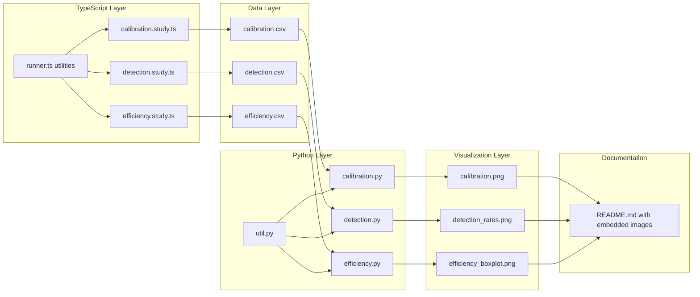

# Design Document: Scientific Evidence Suite

## Context

The confidence-based termination feature in FluentCheck makes statistical claims about test coverage and bug detection. However, the current "evidence" in `test/confidence.test.ts` consists of single-run tests with binary assertions, which is insufficient for establishing scientific credibility.

This design addresses three critical questions:
1. **Calibration**: When we claim "95% confident", is that accurate?
2. **Detection**: Does confidence-based termination find more bugs than fixed N?
3. **Efficiency**: Does it adapt test effort to property complexity?

## Goals

### Primary Goals
- Provide reproducible, auditable evidence for statistical claims
- Generate publication-quality visualizations (histograms, calibration plots)
- Enable external verification (reviewers can re-run with different seeds)
- Establish scientific rigor comparable to academic papers

### Non-Goals
- Real-time evidence generation (too slow for CI/CD)
- Interactive dashboards (static PNGs are sufficient)
- Evidence for every configuration (focus on representative cases)
- Integration with test suite (evidence is separate validation)

## Architecture Overview



## Data Flow

### Phase 1: TypeScript → CSV (5-10 minutes)

**Input**: FluentCheck scenarios with seeded RNG  
**Process**: Run N trials (200-1000) per configuration  
**Output**: CSV files with one row per trial

**Example trial record**:
```csv
trial_id,seed,tests_run,bug_found,claimed_confidence,true_pass_rate,threshold,target_confidence,threshold_actually_met,termination_reason,elapsed_ms
42,332197,234,false,0.951,0.999,0.999,0.95,true,confidence,45
```

**Determinism**: `seed = trial_id * 7919` (prime multiplier for distribution)

### Phase 2: Python → PNG (30 seconds)

**Input**: CSV files from `docs/evidence/raw/`  
**Process**: 
- Load with pandas
- Compute summary statistics (mean, std, quantiles)
- Calculate confidence intervals (Wilson score for proportions)
- Generate plots with matplotlib/seaborn
**Output**: PNG files to `docs/evidence/figures/`

## Study Designs

### 1. Calibration Study

**Hypothesis**: Bayesian confidence calculation is well-calibrated.

**Method**:
- Property with known true pass rate (0.999)
- Ask: "Is pass rate > 0.999?" (answer: barely)
- Target confidence levels: 0.80, 0.90, 0.95, 0.99
- Trials: 1000 per level
- Record: Did we meet the threshold after claiming X% confidence?

**Expected Result**: 95% target should meet threshold ~95% of time.

**CSV Schema**:
```
trial_id, seed, tests_run, bug_found, claimed_confidence, 
true_pass_rate, threshold, target_confidence, threshold_actually_met,
termination_reason, elapsed_ms
```

**Visualization**: 
- Calibration curve: predicted (x-axis) vs observed (y-axis)
- Diagonal line = perfect calibration
- Points should hug the line

### 2. Detection Rate Study

**Hypothesis**: Confidence-based termination finds rare bugs more reliably than fixed N.

**Method**:
- Property: `x % 500 !== 0` (0.2% failure rate)
- Methods tested:
  - Fixed N=100 (baseline)
  - Fixed N=500 (comparable cost to confidence 95%)
  - Confidence 90%, 95%, 99% (max 5000 iterations)
- Trials: 500 per method
- Record: Bug found? Tests run? Termination reason?

**Expected Result**: Confidence-based should have higher detection rate than fixed N with similar test budget.

**CSV Schema**:
```
trial_id, seed, tests_run, bug_found, claimed_confidence,
method, bug_failure_rate, termination_reason, elapsed_ms
```

**Visualizations**:
- Bar chart: detection rate with 95% CI error bars
- Histogram: tests-to-termination distribution (stacked by method)

### 3. Efficiency Study

**Hypothesis**: Confidence-based termination adapts test effort to property difficulty.

**Method**:
- Property 1: Always true (`x * x >= 0`)
- Property 2: 1% failure rate (`x % 100 !== 0`)
- Target: 95% confidence
- Trials: 200 each
- Record: Tests until termination

**Expected Result**: Property 1 terminates much earlier (fewer tests needed for high confidence).

**CSV Schema**:
```
trial_id, seed, tests_run, bug_found, claimed_confidence,
property_type, target_confidence, termination_reason, elapsed_ms
```

**Visualization**: Box plot comparing distributions (median, quartiles, outliers)

## Technical Decisions

### Why CSV over JSON?

- **Auditability**: Easier to inspect in spreadsheet tools
- **Universality**: Any analysis tool (R, Python, Excel) can read
- **Simplicity**: No schema validation needed
- **Size**: More compact than JSON for tabular data

### Why Python for Analysis?

- **matplotlib/seaborn**: Publication-quality plots with minimal code
- **pandas**: Best-in-class data manipulation
- **scipy**: Statistical functions (confidence intervals, distributions)
- **Ecosystem**: Standard for scientific computing

TypeScript alternatives (Plotly, Vega-Lite) require significantly more setup for comparable output quality.

### Why Separate from CI?

- **Runtime**: 5-10 minutes is too slow for every PR
- **Determinism**: Evidence generation should be deliberate, not automated
- **Versioning**: CSVs and PNGs are versioned artifacts, updated intentionally
- **Focus**: CI validates correctness; evidence validates claims

### Why Deterministic Seeds?

**Reproducibility**: External reviewers can:
1. Clone repo
2. Run `npm run evidence:generate`
3. Verify identical CSV output
4. Audit claims independently

Formula: `seed = trial_id * 7919` ensures:
- Different trials get different seeds
- Same trial_id always gets same seed
- 7919 is prime (good distribution)

## File Organization

```
docs/evidence/
├── raw/                    # CSV data (version-controlled)
│   ├── calibration.csv
│   ├── detection.csv
│   └── efficiency.csv
├── figures/                # PNG plots (version-controlled)
│   ├── calibration.png
│   ├── detection_rates.png
│   ├── detection_histogram.png
│   └── efficiency_boxplot.png
└── README.md               # Main evidence report

scripts/evidence/
├── runner.ts               # Shared utilities (PRNG, CSV writer)
├── calibration.study.ts
├── detection.study.ts
└── efficiency.study.ts

analysis/
├── pyproject.toml          # uv dependencies
├── .python-version
├── util.py                 # Shared plotting code
├── calibration.py
├── detection.py
└── efficiency.py
```

### Why `docs/evidence/` not `openspec/changes/`?

Per `openspec/AGENTS.md`, `changes/` directory is temporary and gets archived after PR merge. Evidence data must persist permanently, so it lives in `docs/`.

## Python Environment Setup

Using **uv** (fast, modern Python package manager):

```bash
cd analysis
uv init
uv add matplotlib seaborn pandas numpy scipy
uv sync
```

**Dependencies**:
- `matplotlib>=3.8.0` - Plotting
- `seaborn>=0.13.0` - Statistical visualizations
- `pandas>=2.1.0` - Data manipulation
- `numpy>=1.26.0` - Numerical operations
- `scipy>=1.11.0` - Statistical functions

**Execution**:
```bash
# Via uv
uv run calibration.py

# Or via activated venv
source .venv/bin/activate
python calibration.py
deactivate
```

## npm Scripts Integration

```json
{
  "scripts": {
    "evidence:generate": "tsx scripts/evidence/calibration.study.ts && tsx scripts/evidence/detection.study.ts && tsx scripts/evidence/efficiency.study.ts",
    "evidence:analyze": "cd analysis && uv run calibration.py && uv run detection.py && uv run efficiency.py",
    "evidence": "npm run evidence:generate && npm run evidence:analyze",
    "evidence:quick": "QUICK_MODE=1 npm run evidence:generate && npm run evidence:analyze"
  }
}
```

**Quick mode**: Reduces sample sizes (100 trials instead of 1000) for development iteration.

## Risks and Mitigations

### Risk: Python dependency breaks builds

**Mitigation**: 
- Python is optional (not in package.json dependencies)
- Evidence generation is manual, not automated
- CSVs and PNGs are committed, so evidence exists even if Python breaks

### Risk: Long runtime discourages updates

**Mitigation**:
- Quick mode for development
- Evidence updates are infrequent (only when algorithm changes)
- Can parallelize studies (run in separate terminals)

### Risk: Seeded RNG might hide bugs

**Mitigation**:
- Studies test the *statistical properties*, not the feature itself
- Unit tests (in `test/confidence.test.ts`) remain for correctness
- Evidence validates claims, not implementation

### Risk: CSV format changes break Python scripts

**Mitigation**:
- CSV schema is documented in this design doc
- Python scripts validate required columns on load
- TypeScript types for CSV rows ensure consistency

## Migration Plan

This is a pure addition (no breaking changes). Implementation order:

1. **Phase 1**: TypeScript infrastructure
   - Create `scripts/evidence/runner.ts`
   - Implement one study (calibration) end-to-end
   - Validate CSV output format

2. **Phase 2**: Python infrastructure
   - Set up `analysis/` with uv
   - Create `util.py` with shared functions
   - Implement calibration analysis
   - Validate PNG output quality

3. **Phase 3**: Complete studies
   - Implement detection and efficiency studies
   - Generate all CSVs and PNGs
   - Commit baseline evidence

4. **Phase 4**: Documentation
   - Create `docs/evidence/README.md`
   - Embed figures
   - Add interpretation and conclusions

5. **Phase 5**: Cleanup
   - Remove theatrical evidence from `test/confidence.test.ts`
   - Update `docs/statistical-confidence.md` to reference evidence

## Open Questions

None - design is complete and ready for implementation.
